# DomynGraph

**An extensible graph database engine built on JanusGraph.**

DomynGraph is not a wrapper around JanusGraph — it is a custom graph database distribution that ships JanusGraph with a procedure engine (like Neo4j's APOC), a graph algorithm engine (like Neo4j's GDS), and a native multi-tenancy system. It is a single codebase, a single build, a single distribution.

---

## 1. What is DomynGraph

### Problem

Existing graph databases are either:

- **Closed** — Neo4j Enterprise requires licensing and restricts extensibility
- **Limited** — Memgraph, TigerGraph lack the ecosystem and extensibility
- **Raw** — JanusGraph alone has no procedure layer, no algorithm library, no tenancy system

### Solution

DomynGraph = JanusGraph + three engine modules:

| Capability | Neo4j Equivalent | DomynGraph Module |
|---|---|---|
| Graph storage + traversal | Neo4j Core | JanusGraph Core (Cassandra + Gremlin) |
| Reusable procedures | APOC | `domyngraph-procedures` |
| Graph algorithms | GDS | `domyngraph-algorithms` |
| Multi-tenancy | Enterprise (limited) | `domyngraph-tenant` |
| Indexing | Built-in Lucene | Elasticsearch (explicit mappings) |

---

## 2. System Architecture


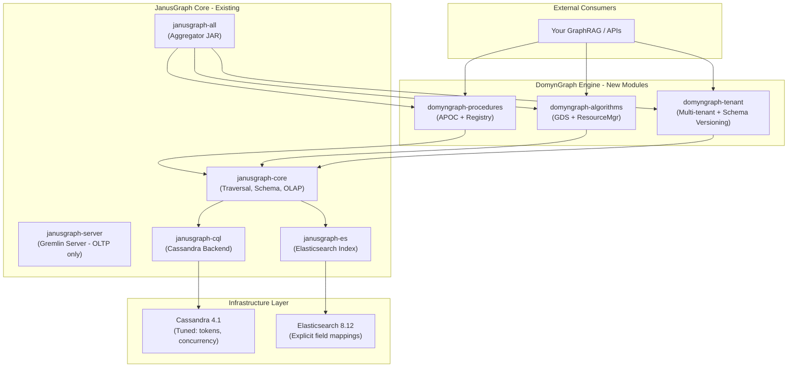

### Key Design Decisions

- **Cassandra** for storage: horizontally scalable, no single point of failure
- **Elasticsearch** for indexing: full-text search, explicit field mappings per property
- **Gremlin Server** for OLTP queries: 30s hard timeout, fixed thread pools
- **FulgoraGraphComputer** for OLAP algorithms: separate execution path, resource-controlled

---

## 3. Execution Model

### OLTP vs OLAP Separation

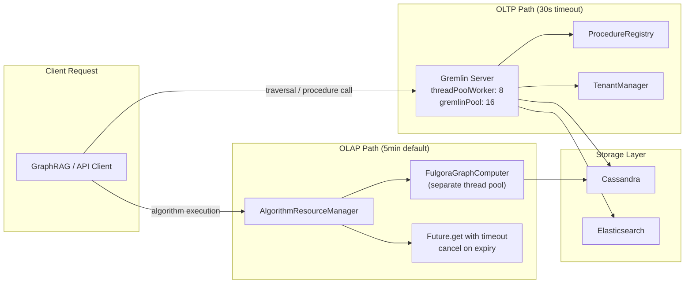

### OLTP (Online Transaction Processing)

- **Engine:** Gremlin Server
- **Operations:** traversals, procedure calls, tenant operations, CRUD
- **Timeout:** 30 seconds (hard limit in `gremlin-server-domyngraph.yaml`)
- **Thread pool:** Fixed (`threadPoolWorker: 8`, `gremlinPool: 16`)
- **Access:** WebSocket on port 8182

### OLAP (Online Analytical Processing)

- **Engine:** FulgoraGraphComputer (JanusGraph's GraphComputer implementation)
- **Operations:** PageRank, shortest distance, connected components, BFS
- **Timeout:** Configurable per algorithm (default 5 minutes)
- **Thread pool:** Separate from Gremlin Server, controlled by `AlgorithmResourceManager`
- **Access:** Programmatic via `AlgorithmResourceManager.execute()`

**These two execution paths are architecturally separated.** An algorithm cannot starve Gremlin Server, and a slow query cannot block algorithm execution.

---

## 4. Module Breakdown

### Module Dependency Graph

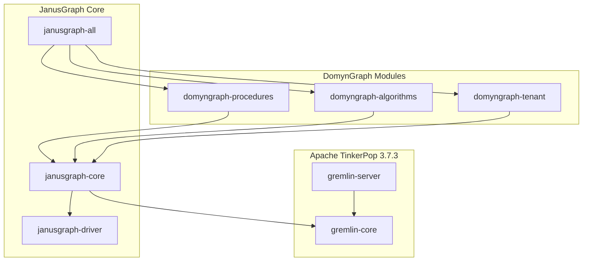

### `domyngraph-procedures` — APOC Equivalent

**Purpose:** Reusable, registered, introspectable graph procedures.

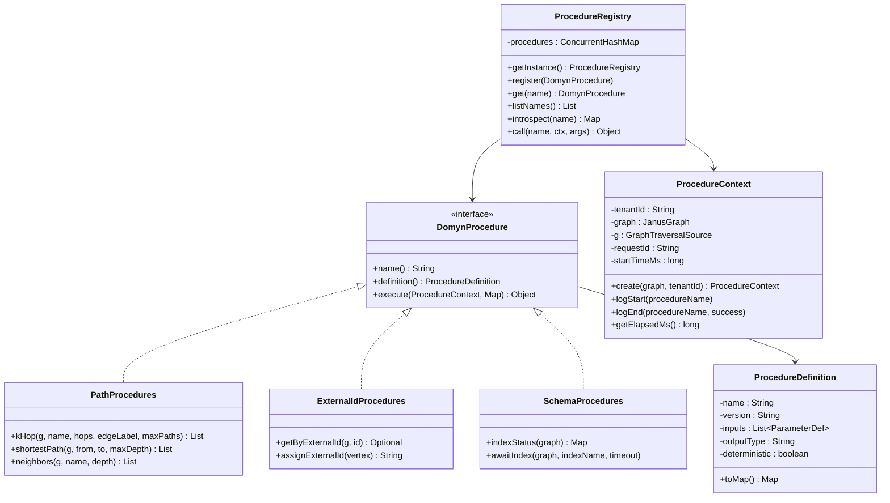

### `domyngraph-algorithms` — GDS Equivalent

**Purpose:** Resource-controlled graph algorithms running on GraphComputer.

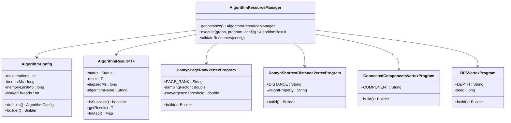

### Algorithm Execution Flow

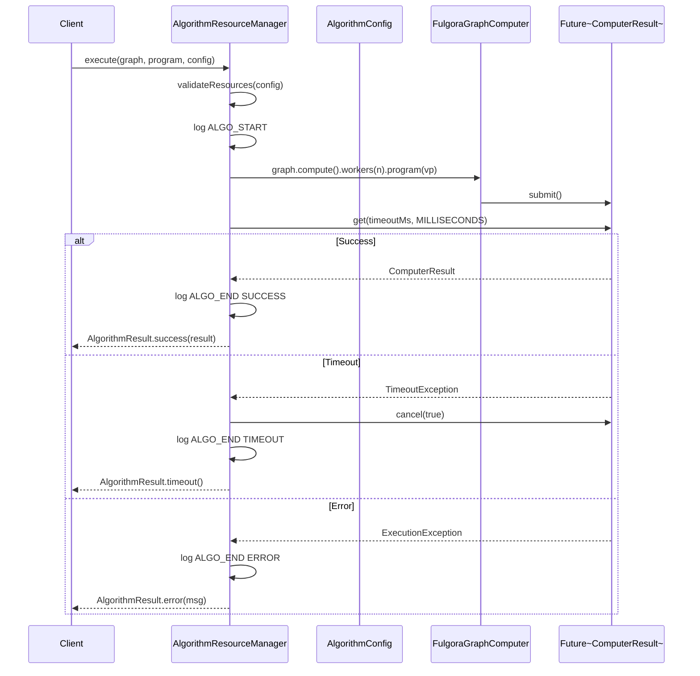

### `domyngraph-tenant` — Multi-Tenancy Engine

**Purpose:** DB-level tenant isolation, schema versioning, migration.

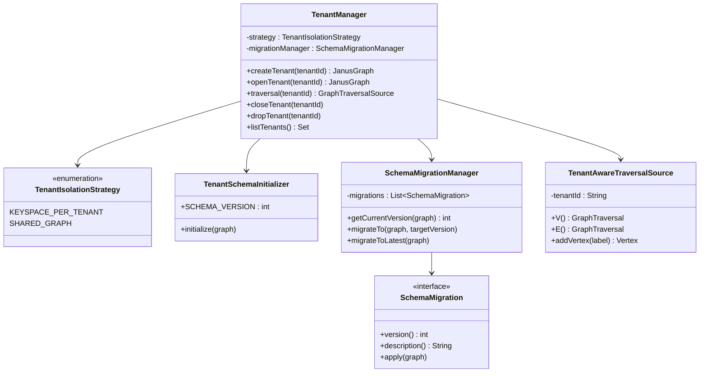

---

## 5. Data Model

### Graph Schema Overview

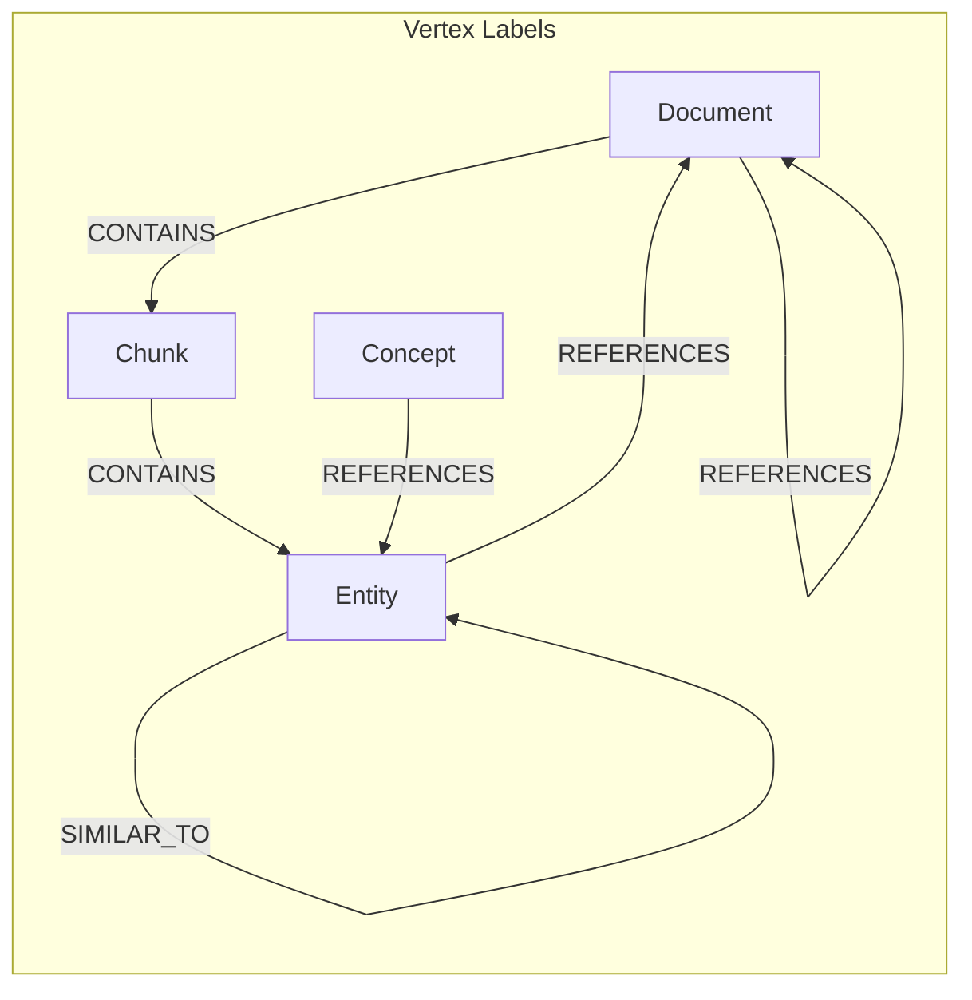

### Vertex Labels

| Label | Purpose |
|---|---|
| `Entity` | Named entities (people, companies, concepts) |
| `Chunk` | Text chunks from documents |
| `Document` | Source documents |
| `Concept` | Abstract concepts / topics |

### Edge Labels

| Label | Multiplicity | Purpose |
|---|---|---|
| `RELATION` | MULTI | General relationships between entities |
| `CONTAINS` | MULTI | Document contains chunk, chunk contains entity |
| `REFERENCES` | MULTI | Cross-references between entities/documents |
| `SIMILAR_TO` | MULTI | Similarity edges (from embeddings, algorithms) |

### Property Keys

| Property | Type | Indexed | Purpose |
|---|---|---|---|
| `name` | String | Composite + Text (ES) | Primary name of the vertex |
| `type` | String | Composite + Keyword (ES) | Subtype classification |
| `tenant_id` | String | Composite + Keyword (ES) | Tenant isolation key |
| `external_id` | String | Composite (unique) + Keyword (ES) | External system integration key |
| `created_at` | Long | ES (sortable) | Creation timestamp |
| `description` | String | Text (ES) | Full-text searchable description |
| `weight` | Double | — | Edge weight for algorithms |
| `embedding` | byte[] | — | Vector embedding (stored, not indexed) |
| `metadata` | String | — | JSON metadata blob |

---

## 6. Indexing Strategy

### Dual Index Architecture

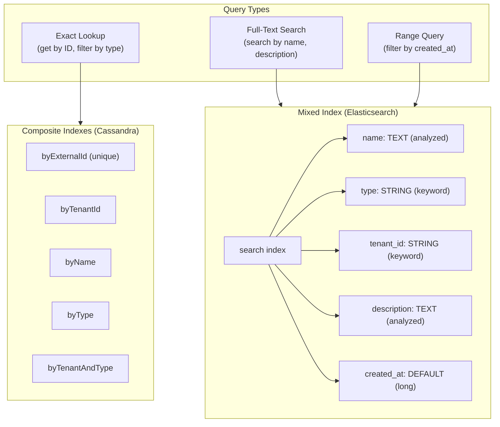

### Index Lifecycle

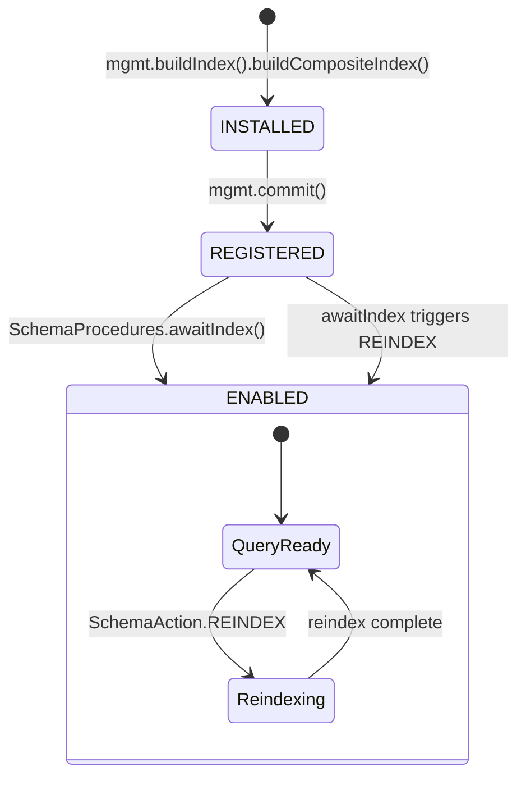

JanusGraph indexes transition through states: `INSTALLED` -> `REGISTERED` -> `ENABLED`. Use `SchemaProcedures.awaitIndex()` to manage this lifecycle — it waits for `REGISTERED`, triggers `REINDEX`, then waits for `ENABLED`.

---

## 7. Multi-Tenancy Model

### Isolation Strategy Comparison

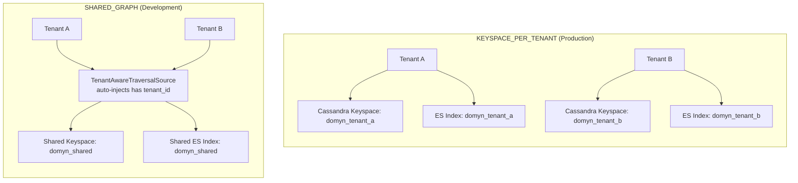

### Tenant Lifecycle Flow

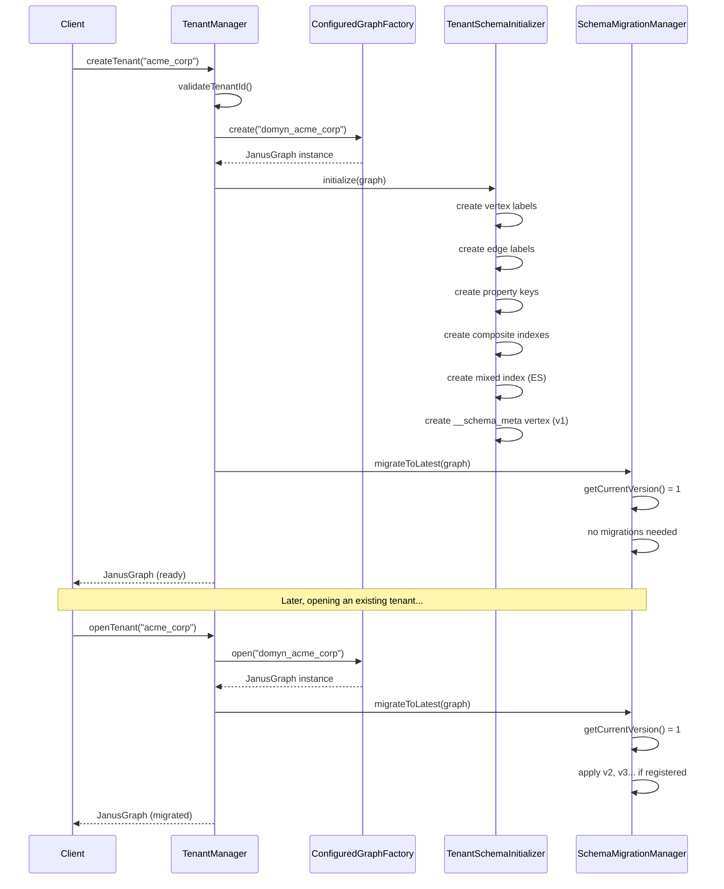

### KEYSPACE_PER_TENANT (recommended for production)

- Each tenant gets its own Cassandra keyspace (`domyn_<tenantId>`)
- Each tenant gets its own Elasticsearch index
- Complete physical isolation — no data can leak between tenants
- Higher resource cost (one graph instance per tenant)
- Uses `ConfiguredGraphFactory` under the hood

### SHARED_GRAPH (lightweight, development/small deployments)

- All tenants share one keyspace and one ES index
- Isolation enforced by `tenant_id` property on every vertex/edge
- `TenantAwareTraversalSource` auto-injects `has('tenant_id', tenantId)`
- Lower cost, but requires discipline — every query must filter by tenant

---

## 8. Procedure Execution Flow

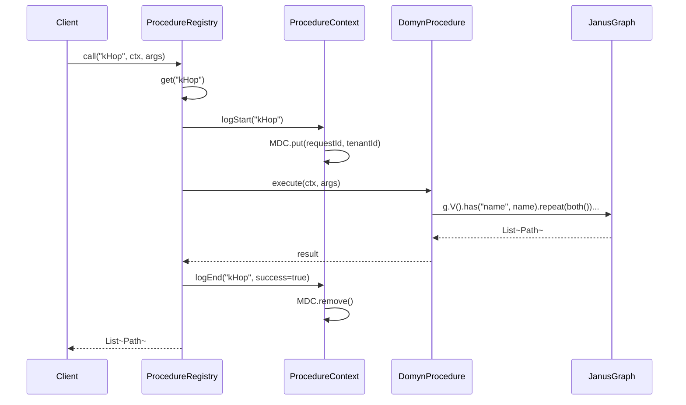

---

## 9. Docker Deployment Architecture

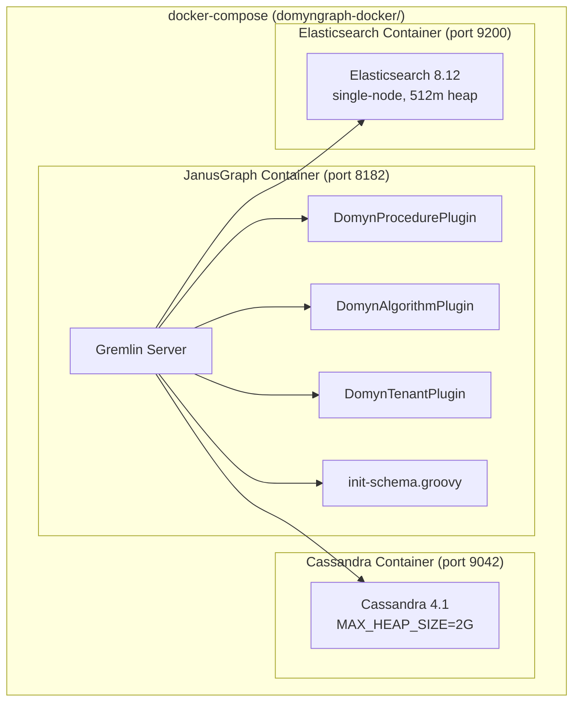

---

## 10. Build & Run

### Prerequisites

- Java 8+ (Java 11 recommended)
- Maven 3.2.5+
- Docker + Docker Compose

### Build

```bash
cd domyn-janusgraph

# Build only DomynGraph modules (fast)
mvn clean install -pl domyngraph-procedures,domyngraph-algorithms,domyngraph-tenant \
    -am -DskipTests -Drat.skip=true -Dcheckstyle.skip=true \
    -Denforcer.skip=true -Dcyclonedx.skip=true

# Build everything
mvn clean install -DskipTests -Drat.skip=true -Dcheckstyle.skip=true \
    -Denforcer.skip=true -Dcyclonedx.skip=true
```

### Run (Docker)

```bash
cd domyngraph-docker
docker-compose up -d

# Verify services
curl http://localhost:9200/_cluster/health  # Elasticsearch
docker exec domyn-cassandra cqlsh -e "describe cluster"  # Cassandra
curl http://localhost:8182                   # JanusGraph / Gremlin Server
```

### Connect (Gremlin Console)

```bash
bin/gremlin.sh
:remote connect tinkerpop.server conf/remote.yaml
:remote console
```

---

## 11. Example Usage

```groovy
// List all registered procedures
DomynProcedures.list()
// => ["getByExternalId", "indexStatus", "kHop"]

// Describe a procedure
DomynProcedures.describe("kHop")
// => {name: "kHop", version: "1.0", inputs: [...], outputType: "path[]", ...}

// Create a tenant
mgr = new TenantManager(TenantIsolationStrategy.KEYSPACE_PER_TENANT)
graph = mgr.createTenant("acme_corp")
g = graph.traversal()

// Add data with external IDs
v1 = g.addV("Entity").property("name", "Tesla").property("type", "Company").next()
ExternalIdProcedures.assignExternalId(v1)

v2 = g.addV("Entity").property("name", "Elon Musk").property("type", "Person").next()
ExternalIdProcedures.assignExternalId(v2)

g.V(v1).addE("RELATION").to(v2).property("weight", 0.95).iterate()
graph.tx().commit()

// k-Hop traversal
PathProcedures.kHop(g, "Tesla", 2, null, 100)

// Lookup by external ID
ExternalIdProcedures.getByExternalId(g, "some-uuid-here")

// Check index status
SchemaProcedures.indexStatus(graph)

// Run PageRank (OLAP — separate execution path)
config = AlgorithmConfig.builder().maxIterations(30).timeoutMs(60000).build()
program = DomynPageRankVertexProgram.build().vertexCount(10000).dampingFactor(0.85).create()
result = AlgorithmResourceManager.getInstance().execute(graph, program, config)
result.isSuccess()     // true
result.getElapsedMs()  // timing in ms
```

---

## 12. Extending DomynGraph

### Adding a Procedure

```java
public class MyProcedure implements DomynProcedure {

    private static final ProcedureDefinition DEF = ProcedureDefinition.builder("myProc")
        .version("1.0")
        .description("Does something useful")
        .addInput(ParameterDef.required("param1", "String", "First param"))
        .outputType("vertex[]")
        .deterministic(true)
        .build();

    @Override public String name() { return "myProc"; }
    @Override public ProcedureDefinition definition() { return DEF; }

    @Override
    public Object execute(ProcedureContext ctx, Map<String, Object> args) {
        return ctx.traversal().V().has("name", args.get("param1")).toList();
    }
}
```

Then register it in `DomynProcedurePlugin.registerBuiltinProcedures()`.

### Adding an Algorithm

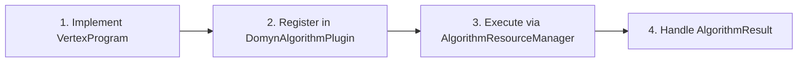

1. Implement a `VertexProgram<T>` (see `DomynPageRankVertexProgram` as reference)
2. Always run through `AlgorithmResourceManager.execute()` with an `AlgorithmConfig`
3. Register in `DomynAlgorithmPlugin`

### Adding a Schema Migration

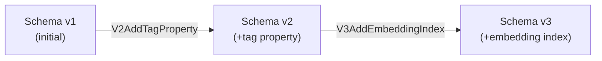

```java
public class V2AddTagProperty implements SchemaMigration {
    @Override public int version() { return 2; }
    @Override public String description() { return "Add tag property + index"; }

    @Override
    public void apply(JanusGraph graph) {
        JanusGraphManagement mgmt = graph.openManagement();
        PropertyKey tag = mgmt.makePropertyKey("tag").dataType(String.class).make();
        mgmt.buildIndex("byTag", Vertex.class).addKey(tag).buildCompositeIndex();
        mgmt.commit();
    }
}
```

Then add to `SchemaMigrationManager`:

```java
migrationManager.addMigration(new V2AddTagProperty());
```

---

## 13. Design Principles

1. **Never expose raw Gremlin externally** — all access goes through procedures with `ProcedureContext`
2. **Always use `external_id`** — JanusGraph internal IDs are non-portable; external_id is the integration key
3. **Enforce tenant isolation** — every query in shared mode must filter by `tenant_id`
4. **OLTP is not OLAP** — traversals and algorithms run on separate execution paths with separate resource limits
5. **Schema is versioned** — every graph tracks its schema version; migrations are applied on open
6. **Indexes have lifecycles** — never query an index that isn't ENABLED; use `awaitIndex()` after creation

---

## 14. Project Structure

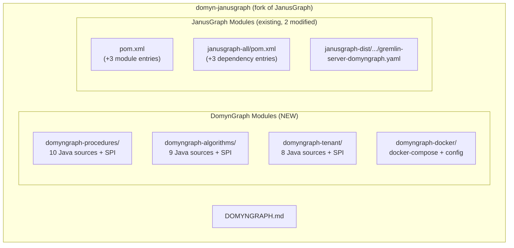

---

## 15. Syncing with Upstream JanusGraph

This is a fork. To pull in the latest JanusGraph changes:

```bash
git fetch upstream
git merge upstream/master
```

DomynGraph modules are additive — they do not modify existing JanusGraph source files (only `pom.xml` and `janusgraph-all/pom.xml` have additions). Merge conflicts should be minimal.

---

## License

Apache License 2.0 (same as JanusGraph)
