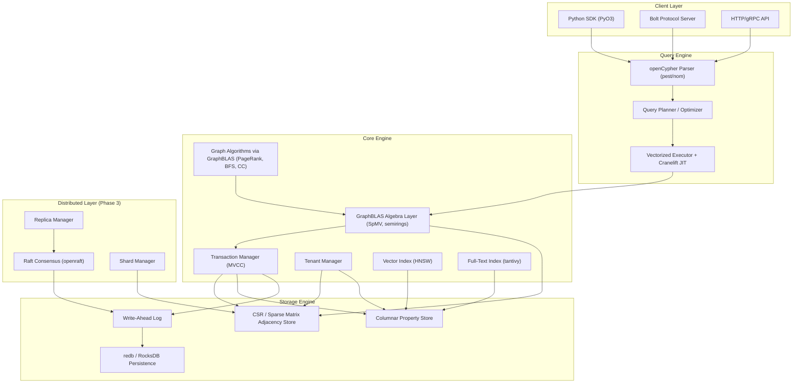
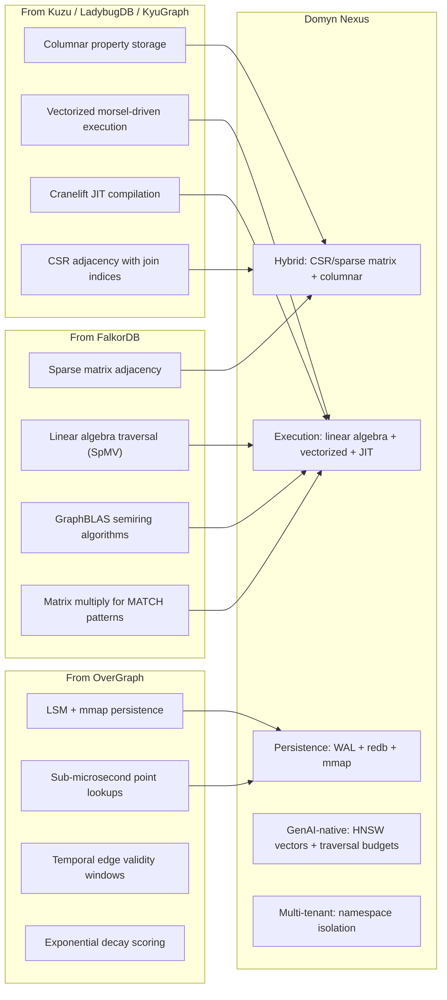
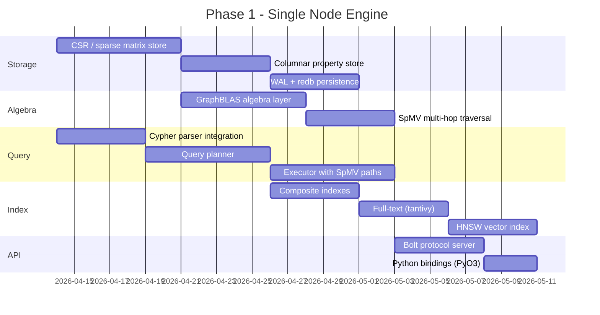

# Domyn Nexus: A Rust Graph Database for GenAI

**Location:** `/Users/josephthomasthachil/Desktop/Domyn/GRAPH/domyn-nexus/`
**Sibling to:** `domyn-janusgraph/` (completely untouched)

## Why Build From Scratch

Your current stack (JanusGraph + Cassandra + Elasticsearch + Gremlin) was a necessary starting point, but you've already documented its fundamental limitations in `GRAPHRAG_ARCHITECTURE.md`:

- Entry via `g.V().has(...)` costs 20-100ms (distributed index + ES + Cassandra round-trip)
- Cassandra read amplification on every traversal hop
- Three separate systems (Cassandra, ES, JanusGraph) to deploy, tune, and scale
- Gremlin is verbose and your GraphRAG system is built for Cypher
- Multi-tenancy requires either property-level filtering (leaky) or keyspace-per-tenant (expensive)

A purpose-built engine eliminates all of these by design.

## What You're Building

**Domyn Nexus** -- a single Rust binary that is:

- **Cypher-native**: openCypher query language, no translation layer
- **Multi-tenant**: Tenant isolation at the storage layer, not property filtering
- **Horizontally scalable**: Raft-based replication, sharded storage
- **GenAI-first**: Native vector index for embeddings, built-in GraphRAG traversal primitives
- **Embeddable or server**: Can run as a library (PyO3) or standalone server

## Architecture Overview




## Design Influences

This engine combines ideas from three best-in-class systems, each contributing a specific architectural insight:




**FalkorDB's core insight**: Represent the graph as sparse adjacency matrices and execute traversals as linear algebra operations (sparse matrix-vector multiply). A k-hop traversal becomes k SpMV operations that are parallelizable and SIMD-friendly, instead of exponential pointer-chasing. This is why FalkorDB achieves 10x lower p50 latency than Neo4j, and 344x lower p99 under load. Their 7-hop traversals complete in 0.33s where competitors time out.

**Kuzu/LadybugDB's core insight**: Columnar storage with vectorized execution and JIT compilation. Properties stored as typed flat arrays eliminate per-vertex object overhead. Cranelift JIT delivers 22x speedup for filter predicates.

**OverGraph's core insight**: LSM + mmap gives sub-microsecond point lookups (~200ns) and 625K+ writes/sec in pure Rust, with zero-copy reads.

## Key Design Decisions

### 1. Storage: Sparse Matrix + Columnar (FalkorDB + Kuzu hybrid)

The adjacency structure serves dual roles -- both as a CSR store for single-hop lookups AND as a sparse matrix for linear algebra operations:

- **CSR (Compressed Sparse Row)** for adjacency: O(1) out-degree, sequential memory access, cache-friendly neighbor traversal (~2us per hop)
- **CSR is also the native format for GraphBLAS sparse matrices**: no conversion needed between storage and algebra layers
- **Per-edge-label matrices**: each relationship type (e.g., `Discloses`, `Operates_In`) gets its own sparse matrix. Predicate-scoped traversal from your `GRAPHRAG_ARCHITECTURE.md` becomes selecting which matrices to multiply.
- **Columnar property storage**: typed flat arrays (int64[], f64[], String[]), SIMD-friendly, no per-vertex object overhead
- **Forward + backward CSR**: bidirectional traversal without separate queries
- **Persistence via redb**: pure Rust, MVCC, stable on-disk format, production-proven

This directly addresses your `GRAPHRAG_ARCHITECTURE.md` constraint: "entry by internal ID, bounded traversal" becomes a native O(1) array lookup, not a distributed Cassandra read.

### 2. Query Language: openCypher

Two strong options exist in the Rust ecosystem:

- **OCG** (openCypher Graph): 100% openCypher TCK compliance (3,897/3,897 tests), 4 pluggable backends, 175+ graph algorithms, Python bindings via PyO3. Latest release Feb 2026.
- **KyuGraph**: Rust port of Kuzu, hand-written Cypher parser, columnar storage + CSR, MVCC, Cranelift JIT (22x speedup), Arrow Flight Protocol. Latest release Feb 2026.

**Recommendation**: Start with OCG's parser + TCK compliance as the Cypher frontend, but build your own storage engine (not their PropertyGraph backend). This gives you full openCypher compatibility on day one while controlling the storage layer for multi-tenancy and GenAI features.

### 3. Multi-Tenancy: Storage-Level Isolation

Your current system has two modes documented in [DOMYNGRAPH.md](domyn-janusgraph/DOMYNGRAPH.md):

- `KEYSPACE_PER_TENANT` (production) -- separate Cassandra keyspace per tenant
- `SHARED_GRAPH` (development) -- property-level `tenant_id` filtering

The new engine implements **namespace-level isolation**:

- Each tenant gets its own CSR + column store segment
- Segments are memory-mapped independently
- Cross-tenant queries (your `__ALL__` view) are a union scan over segments
- Tenant creation/deletion is O(1) -- just create/drop a directory
- No risk of data leakage -- physically separate data files

### 4. GenAI-Native Features

Features that don't exist in JanusGraph but are critical for your GraphRAG pipeline:

- **Native HNSW vector index**: Store embeddings directly on vertices, query by similarity without leaving the graph engine (replaces the "Vector DB -> ID mapping -> Graph" pipeline from your architecture doc)
- **Built-in ID mapping**: `external_id -> internal_id` is a first-class index, not a Redis sidecar
- **Traversal budget primitives**: `max_depth`, `max_nodes`, `predicate_filter` are engine-level parameters, not application-level workarounds
- **Subgraph materialization**: Pre-compute and cache common subgraph patterns at the engine level

### 5. GraphBLAS Execution Model (from FalkorDB)

This is the single biggest performance differentiator. Instead of traditional pointer-chasing traversal, multi-hop operations and graph algorithms execute as linear algebra:

**How it works:**

- The graph is stored as a collection of sparse matrices -- one per edge label
- A 1-hop traversal `(a)-[:KNOWS]->(b)` is a sparse matrix-vector multiply: `result = A_knows * v` where `v` is the starting vertex set
- A 2-hop traversal `(a)-[:KNOWS]->(b)-[:WORKS_AT]->(c)` becomes `result = A_works_at * (A_knows * v)` -- two SpMV operations
- Cypher `MATCH` pattern compilation: the query planner decomposes path patterns into a sequence of matrix multiplications over the appropriate edge-label matrices
- Graph algorithms (PageRank, BFS, Connected Components) are implemented as semiring operations on the adjacency matrices, not as Pregel-style vertex programs

**Why this is faster:**

- SpMV operations are embarrassingly parallelizable across CPU cores
- CSR format enables sequential memory access (cache-line friendly) instead of random pointer chasing
- SIMD vectorization applies naturally to the inner loops
- Multi-hop cost grows linearly with hop count, not exponentially with fan-out
- FalkorDB proves this works: 7-hop traversals in 0.33s, p99 latency 344x lower than Neo4j under load

**What we build:**

- A `nexus-algebra` crate providing: `SpMV`, `SpMM` (sparse matrix-matrix), semiring traits, masked operations
- The query executor calls into this algebra layer instead of doing recursive neighbor expansion
- Algorithms in `nexus-algorithms` are expressed as semiring compositions, not custom iteration

### 6. Horizontal Scaling (Phase 3)

Using **openraft** (the modern Rust Raft implementation):

- Hash-based graph partitioning (vertex ID modulo shard count)
- Each shard is a Raft group with configurable replication factor
- Cross-shard traversals use scatter-gather
- Tenant-to-shard affinity to keep tenant data local

## Phased Build Plan

### Phase 1: Single-Node Engine (Weeks 1-6)

The core that replaces JanusGraph locally. When this is done, you can run your existing benchmark suite against it.




### Phase 2: Multi-Tenancy + Algorithms (Weeks 7-10)

Port the DomynGraph Java modules to Rust, with algorithms rewritten as GraphBLAS semiring operations.

- Namespace-level tenant isolation
- Schema versioning and migrations (port `SchemaMigrationManager`)
- Graph algorithms as semiring operations: PageRank (plus-times semiring), BFS (min-plus semiring), Connected Components (min-select semiring), Shortest Path (min-plus semiring with tropical algebra)
- Procedure registry (port `domyngraph-procedures` as Rust traits)
- OLTP/OLAP execution path separation (Tokio async tasks vs rayon compute pool)

### Phase 3: Distributed (Weeks 11-16)

Horizontal scaling.

- Raft consensus via openraft
- Shard manager with consistent hashing
- Cross-shard traversal (scatter-gather)
- Tenant-to-shard affinity
- Replication and failover

### Phase 4: Production Hardening (Weeks 17-20)

- Observability (metrics, tracing, structured logging)
- Benchmarks against JanusGraph, Neo4j, Memgraph
- Migration tooling (import from JanusGraph/Cassandra)
- Docker image and Kubernetes operator
- Updated DomynGraph Lens UI (swap API backend to Nexus)

## Rust Crate Structure

```
domyn-nexus/                          # /Users/josephthomasthachil/Desktop/Domyn/GRAPH/domyn-nexus/
  Cargo.toml (workspace)
  crates/
    nexus-core/               # Graph primitives, CSR / sparse matrix store, property store
    nexus-algebra/            # GraphBLAS-style layer: SpMV, SpMM, semiring traits, masked ops (FalkorDB-inspired)
    nexus-storage/            # WAL, redb persistence, mmap (OverGraph-inspired)
    nexus-cypher/             # Parser, planner, executor -- MATCH compiles to matrix multiplication chains
    nexus-index/              # Composite, full-text (tantivy), vector (HNSW)
    nexus-tenant/             # Namespace isolation, schema versioning
    nexus-algorithms/         # PageRank, BFS, CC, shortest path -- all as semiring ops over sparse matrices
    nexus-server/             # Bolt protocol, HTTP/gRPC, connection pool
    nexus-distributed/        # Raft, sharding, replication (Phase 3)
    nexus-python/             # PyO3 bindings for Python SDK
    nexus-bench/              # Benchmarks (port existing suite)
```

## What Gets Replaced


| Current Component                 | Replaced By                      | Benefit                                            |
| --------------------------------- | -------------------------------- | -------------------------------------------------- |
| JanusGraph (Java)                 | `nexus-core` + `nexus-storage`   | No JVM, no GC pauses, ~200ns node lookups          |
| Cassandra                         | `nexus-storage` (redb + mmap)    | No distributed read amplification for single-node  |
| Elasticsearch                     | `nexus-index` (tantivy)          | Embedded full-text, no separate service            |
| Gremlin                           | `nexus-cypher` (openCypher)      | Native Cypher, your GraphRAG system works natively |
| Redis (ID mapping)                | Built-in `external_id` index     | No sidecar service, O(1) lookup                    |
| `gremlin-server-domyngraph.yaml`  | `nexus-server` config            | Single config file, not 4 services                 |
| `docker-compose.yml` (3 services) | Single binary / single container | Dramatically simpler deployment                    |


## What Gets Preserved

All of your design principles from [DOMYNGRAPH.md](domyn-janusgraph/DOMYNGRAPH.md) and [GRAPHRAG_ARCHITECTURE.md](domyn-janusgraph/GRAPHRAG_ARCHITECTURE.md) carry forward:

- Procedure registry pattern (now Rust traits instead of Java interfaces)
- OLTP/OLAP separation (now async Tokio tasks vs dedicated compute threads)
- Multi-tenancy model (upgraded from property filtering to namespace isolation)
- Schema versioning and migrations
- Traversal budgeting and bounded queries (now engine-enforced, not application-level)
- Two-phase GraphRAG pattern (resolve + traverse) -- but with optional single-engine mode when vector index is used

## Key Dependencies (Rust Crates)

- **ocg** (0.4.5) -- openCypher parser + TCK compliance
- **redb** (4.0.0) -- Persistent storage (pure Rust, MVCC)
- **tantivy** -- Full-text search engine (Rust equivalent of Lucene)
- **hnsw_rs** or **hora** -- HNSW vector index
- **openraft** -- Raft consensus for distributed mode
- **tokio** -- Async runtime
- **rayon** -- Data parallelism for SpMV and graph algorithm compute
- **pyo3** -- Python bindings
- **cranelift** -- JIT compilation for hot query paths (filter predicates, arithmetic projections)
- **tonic** -- gRPC server
- **axum** -- HTTP API
- Custom `nexus-algebra` -- GraphBLAS-inspired sparse matrix algebra (SpMV, SpMM, semiring traits). Built in-house over CSR storage rather than wrapping a C library, for zero-copy integration with the storage layer.

## Expected Performance (Based on Comparable Rust Engines)


| Operation         | JanusGraph (Current)            | Domyn Nexus                                         |
| ----------------- | ------------------------------- | --------------------------------------------------- |
| Node lookup by ID | ~1ms                            | ~200ns                                              |
| 1-hop traversal   | 10-50ms                         | ~2-10us                                             |
| 2-hop traversal   | 50-200ms                        | ~50-500us (SpMV)                                    |
| 5+ hop traversal  | Timeout / OOM                   | ~10-100ms (SpMV scales linearly, not exponentially) |
| Full-text search  | 10-100ms (ES round-trip)        | ~1-5ms (embedded tantivy)                           |
| Vector similarity | N/A (requires external service) | ~1-10ms (native HNSW)                               |
| Batch write       | 5-20K/s                         | 500K+/s                                             |
| Memory per node   | ~100+ bytes (JVM objects)       | ~16-32 bytes (CSR + columnar)                       |


These targets are based on published benchmarks from OverGraph (~200ns lookups, ~2us traversals, 625K writes/s), KyuGraph (22x JIT speedup), and FalkorDB (10x lower p50 than Neo4j, 344x lower p99 under load, 0.33s 7-hop traversals via SpMV) and basic experiments I have ran.

## Risk Assessment


| Risk                                    | Impact     | Mitigation                                                              |
| --------------------------------------- | ---------- | ----------------------------------------------------------------------- |
| openCypher TCK edge cases               | Medium     | OCG already passes 3,897/3,897 tests; use as reference                  |
| Distributed mode complexity             | High       | Phase 3 is separate; single-node engine is independently valuable       |
| Migration from existing JanusGraph data | Medium     | Build import tool that reads Cassandra/Gremlin and writes to new format |
| Rust learning curve                     | Low-Medium | Core algorithms are well-documented; leverage existing crates           |
| Feature parity with JanusGraph modules  | Medium     | Port incrementally; Java modules serve as specification                 |


## Immediate First Step

Create `/Users/josephthomasthachil/Desktop/Domyn/GRAPH/domyn-nexus/` with the Rust workspace, crate structure, and implement the core storage engine (CSR adjacency + columnar properties + redb persistence). This is the foundation everything else builds on. The existing `domyn-janusgraph/` folder is not modified.