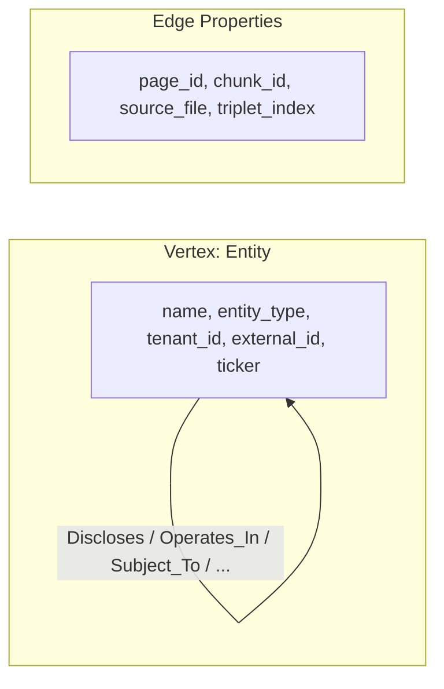
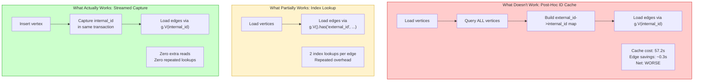

# DomynGraph Benchmark

## Key Finding

**JanusGraph ingestion performance is dominated by vertex resolution strategy, not raw write throughput.**

Capturing internal IDs during vertex insertion ("streamed mode") eliminates the need for both index lookups and post-hoc graph scans, reducing ingestion time by up to 2--4x compared to naive approaches.

> The optimal JanusGraph ingestion strategy is to resolve identity at write-time, not query-time.

---

## Dataset

Real 10-K SEC filing knowledge graph data from 18 companies (~47.5K vertices, ~64.9K edges, 1,133 unique predicates).



### External ID Design

```
external_id = "{tenant_id}:{name}:{entity_type}"
```

Prevents collisions when the same entity name appears across tickers (e.g., "SEC" in every filing). The `tenant_id` prefix ensures global uniqueness even without Neo4j multi-db. Each ticker = one tenant.

---

## Results

### Ingestion -- Full Dataset (B2: 47,542 vertices, 64,891 edges)

| Mode | Time | Notes |
|---|---|---|
| Neo4j | **8.2s** | Baseline |
| JG Fair | 50.4s | `external_id` index lookups (2 per edge) |
| JG Optimized | 100.9s | Post-hoc ID cache -- **57.2s overhead made it worse** |
| JG Streamed | **56.6s** | IDs captured during insert -- zero extra reads |

### Ingestion -- Single Ticker (B1: AAPL, 1,644 vertices, 2,208 edges)

| Mode | Time |
|---|---|
| Neo4j | **1.1s** |
| JG Fair | 8.9s |
| JG Optimized | 4.3s |
| JG Streamed | **2.0s** |

### Query Benchmarks (p50 latency, 10 measured iterations)

| Benchmark | JanusGraph | Neo4j | Gap |
|---|---|---|---|
| B3: Point Lookup | 1.1ms | 0.9ms | ~1.2x |
| B4: Fulltext Search | 107.5ms | 71.1ms | ~1.5x |
| B5: 1-Hop Traversal | 65.0ms | 26.4ms | ~2.5x |
| B6: 2-Hop Traversal | 34.0ms | 11.5ms | ~3x |
| B7: Filtered Traversal | 33.6ms | 18.9ms | ~1.8x |
| B8: Count By Type | 18.8ms | 3.4ms | ~5.5x |
| B9: Top Connected | 25.7ms | 4.1ms | ~6.3x |
| B10: Tenant Isolation | 3.7ms | 1.2ms | ~3.1x |

Query latency gap increases with traversal depth, aggregation complexity, and fan-out size. JanusGraph performs well for point lookups but degrades for high fan-out and aggregation-heavy queries due to Cassandra read amplification.

### Neo4j vs JanusGraph -- Correct Framing

| Scenario | Gap | Why |
|---|---|---|
| Naive ingestion (fair) | ~6x | JG pays index lookup cost per edge endpoint |
| Optimized (streamed) | ~7x (bulk) / ~2x (single) | JG eliminates lookups, but Cassandra round-trips remain |
| Point queries | ~1.2x | Both hit indexed paths -- gap is minimal |
| Traversals | ~2--3x | Neo4j's native pointer-based adjacency wins |
| Aggregations | ~5--6x | Distributed read amplification in JG/Cassandra |

Neo4j maintains a consistent advantage due to:

- Native pointer-based storage (index-free adjacency)
- No distributed read amplification
- Tightly coupled index + traversal engine

---

## The Three Ingestion Strategies (And Why Only One Works)



### Strategy 1: Index-Based Resolution ("Fair" Mode) -- Baseline

```
Load vertices -> Load edges (g.V().has('external_id', ...) per endpoint)
```

- 2 index lookups per edge
- Comparable to Neo4j's `MATCH (n {external_id: ...})`
- Result: **50.4s** -- the repeated lookup overhead accumulates

### Strategy 2: Post-Hoc ID Cache ("Optimized" Mode) -- The Trap

```
Load vertices -> Query ALL vertices -> Build cache -> Load edges
```

- Appears optimal on paper: edges use `g.V(internalId)` with O(1) access
- Reality: the cache-build query (scanning the entire graph) costs **57.2s** -- more than the edge creation itself
- Result: **100.9s** -- the "optimization" made it 2x slower
- Lesson: **post-hoc caching is a trap at scale in distributed graph systems**

### Strategy 3: Streamed ID Capture ("Streamed" Mode) -- The Correct Pattern

```
Insert vertex -> capture internal_id in same response -> reuse for edges
```

- Internal IDs are captured during vertex insertion, not queried afterward
- Cache build cost: **0.0s** (IDs arrive for free with write acknowledgment)
- Edges still use `g.V(internalId)` with O(1) access
- Result: **56.6s** -- only 12% slower than fair mode, but with a fundamentally better architecture

---

## Lessons Learned

### 1. Post-hoc caching is a trap

Querying the graph to build an ID cache appears optimal -- `g.V(id)` is O(1), so surely pre-building a map saves time? At scale in a distributed system, the full-graph scan to build that cache costs more than the per-edge index lookups it replaces. The cache is only beneficial if it's built for free during ingestion.

### 2. Benchmark order matters

JanusGraph caches recently accessed vertices in Cassandra's row cache and in JVM heap. Running "optimized" mode after "fair" mode benefits from warm caches. All reported numbers use clean graph state per mode to avoid this bias.

### 3. Escaping bugs silently break Gremlin scripts

Entity names containing single quotes (e.g., "Intuit's Common Stock") require correct Groovy string escaping (`\'`). Double-escaping (`\\'`) produces valid-looking scripts that fail at runtime with cryptic `Unexpected input: '('` errors. This was caught during the query benchmark phase.

### 4. `storage.batch-loading` is not runtime-configurable

JanusGraph's batch-loading mode (which disables locking and consistency checks) is a local configuration option. It cannot be toggled via the management API at runtime -- it requires a server restart with the config flag set. The benchmark handles this gracefully, logging a warning and continuing without it.

---

## Implications for GraphRAG

This benchmark reveals a critical design principle for using JanusGraph in retrieval-augmented generation pipelines.

**Bad pattern -- using JanusGraph as a search engine:**

```
User query -> graph search via g.V().has(...) -> slow
```

**Correct pattern -- using JanusGraph as a traversal engine:**

```
Vector DB -> entity IDs -> g.V(id) -> traversal -> LLM context
```

JanusGraph works well for GraphRAG **only when used as a traversal engine, not a search engine.** Point lookups by internal ID are fast (~1ms). The bottleneck is always the resolution step -- converting a name or attribute into a graph-internal reference. That resolution belongs in a vector database or search index, not in the graph layer.

### Recommended Hybrid Architecture

```
Vector DB (search + ID mapping) -> Graph DB (traversal) -> LLM
```

- **Neo4j** is better for low-latency interactive systems where the graph is both the search layer and the traversal layer.
- **JanusGraph** is better for large-scale, distributed graphs where a separate search layer (Elasticsearch, vector DB) handles entity resolution and the graph handles multi-hop traversal.

---

## Measurement Protocol

Each query benchmark runs:
1. **1 cold run** (discarded -- JVM class loading, cache cold)
2. **2 warm-up runs** (discarded -- JIT compilation, cache warming)
3. **N measured runs** (default 10) -- these are recorded

Statistics computed: p50, p95, p99, mean, std_dev, ops/sec.

### Traversal Fairness

All traversals use identical semantics across engines:
- `dedup()` / `DISTINCT` on results
- `limit(100)` on all traversal outputs
- Same seed vertices for both engines (pre-selected random set)

Batch sizes were tuned to reasonable production defaults per engine, not artificially equalized.

---

## Ingestion Pipeline Details

### JanusGraph Loader

- Pre-registers all 1,133 edge labels in chunked management transactions (200 per chunk)
- Vertices loaded in batches of **500**, edges in batches of **200**
- Batches submitted in parallel via **ThreadPoolExecutor** (4 workers)
- Each batch commits its own transaction
- Throughput is constrained not only by Gremlin execution but also by Cassandra write throughput and compaction behavior

### Neo4j Loader

- Vertices loaded via `UNWIND/MERGE` in batches of **1,000**
- Edges grouped by predicate (Neo4j cannot parameterize relationship types), then predicate groups processed in parallel via ThreadPoolExecutor (4 workers)
- Each worker opens its own session for transaction isolation
- Edge sub-batches of 500 within each predicate group
- Retry logic (3 attempts with backoff) for deadlock-prone edge batches

---

## Prerequisites

- Python 3.10+
- JanusGraph running (default `ws://localhost:8182/gremlin`)
- Neo4j CE running (default `neo4j://127.0.0.1:7687`)
- Triplet JSON files in the data directory

### Neo4j Setup

Run these in Neo4j Browser before benchmarking:

```cypher
CREATE CONSTRAINT entity_external_id IF NOT EXISTS
FOR (e:Entity) REQUIRE e.external_id IS UNIQUE;

CREATE INDEX entity_tenant IF NOT EXISTS FOR (e:Entity) ON (e.tenant_id);
CREATE INDEX entity_name IF NOT EXISTS FOR (e:Entity) ON (e.name);
CREATE INDEX entity_type IF NOT EXISTS FOR (e:Entity) ON (e.entity_type);

CREATE FULLTEXT INDEX entity_search IF NOT EXISTS
FOR (e:Entity) ON EACH [e.name];
```

Verify all indexes show `ONLINE`:

```cypher
SHOW INDEXES;
```

## Install

```bash
cd domyngraph-benchmark
pip install -r requirements.txt
```

## Usage

### Parse only (no DB needed)

```bash
python run_benchmark.py --mode parse-only
```

### Full benchmark (ingest + queries)

```bash
python run_benchmark.py --mode full \
  --jg-url ws://localhost:8182/gremlin \
  --neo4j-uri neo4j://127.0.0.1:7687 \
  --neo4j-user neo4j \
  --neo4j-pass neo4jtest123 \
  --iterations 10 \
  --output-dir results
```

### JanusGraph ingestion mode

```bash
python run_benchmark.py --mode full --jg-mode fair       # external_id lookups only
python run_benchmark.py --mode full --jg-mode optimized  # post-hoc ID cache
python run_benchmark.py --mode full --jg-mode streamed   # capture IDs during insert (recommended)
python run_benchmark.py --mode full --jg-mode all        # run all 3 modes (default)
```

### Query-only benchmark (data already loaded)

```bash
python run_benchmark.py --mode query-only --iterations 10
```

## Benchmarks

| ID  | Benchmark | Category | Description |
|-----|-----------|----------|-------------|
| B1  | Single Load | write | Load one company (vertices + edges) |
| B2  | Bulk Load | write | Load all 18 companies |
| B3  | Point Lookup | read | Lookup by `external_id` index |
| B4  | Fulltext Search | read | Full-text search on name field |
| B5  | 1-Hop Traversal | traversal | Expand direct neighbors with dedup + limit |
| B6  | 2-Hop Traversal | traversal | Two-hop expansion with dedup + limit |
| B7  | Filtered Traversal | traversal | Traverse edges of a specific predicate type |
| B8  | Count By Type | aggregation | Group vertices by `entity_type` within a tenant |
| B9  | Top Connected | aggregation | Top-10 highest-degree nodes in a tenant |
| B10 | Tenant Isolation | correctness | Verify zero cross-tenant vertex overlap |
| B11 | Memory Footprint | meta | JVM heap stats |
| B12 | Index Verification | meta | Profile query plans to confirm index usage |
| B13 | Graph Stats | meta | Total vertex/edge counts, average degree |

## Output

Results are saved to the output directory:
- `<timestamp>_raw.json` -- raw benchmark data with all individual timings
- `<timestamp>_summary.csv` -- summary table with percentile stats
- `<timestamp>_latency_bar.png` -- p50 latency comparison bar chart
- `<timestamp>_percentiles.png` -- p50/p95/p99 grouped comparison
- `<timestamp>_latency_box.png` -- latency distribution box plots
- `<timestamp>_throughput.png` -- write throughput comparison

## Project Structure

```
domyngraph-benchmark/
  etl/
    parser.py            # Shared triplet parser (dedupe, normalize, extract predicates)
    load_janusgraph.py   # JG loader (3-mode: fair/optimized/streamed, batch 500V/200E, 4-worker parallel)
    load_neo4j.py        # Neo4j loader (batch 1000V/500E, parallel predicate groups, deadlock retry)
  benchmark/
    queries_jg.py        # Gremlin query templates (B3-B13)
    queries_neo4j.py     # Cypher query templates (B3-B13)
    runner.py            # Benchmark execution engine (cold/warm/measured protocol)
    report.py            # JSON/CSV export + matplotlib charts
  run_benchmark.py       # CLI entry point (--jg-mode fair|optimized|streamed|all)
  requirements.txt
```

---

This benchmark demonstrates that graph database performance is not determined solely by the storage engine, but by how identity resolution and traversal access patterns are implemented.
